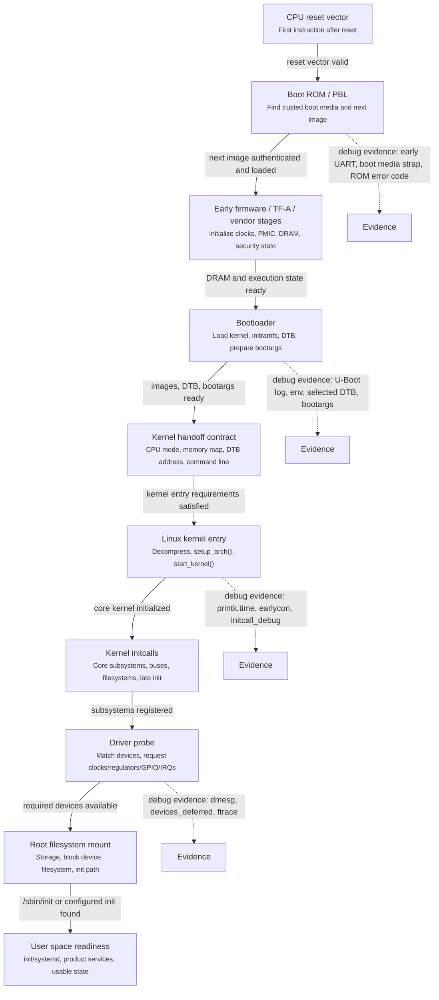
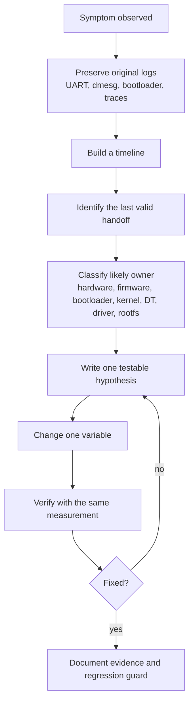

# Module 00 — Foundations for Kernel Bring-up Engineers

## Mental model

Embedded Linux boot is a chain of contracts. Each stage prepares the world for the next stage:

1. The CPU reset vector starts immutable ROM or early firmware.
2. Firmware configures minimal clocks, memory, and security state.
3. The bootloader loads images, verifies them if needed, prepares the device tree, and jumps to the kernel.
4. The kernel initializes CPU, memory, scheduler, IRQs, timers, driver model, filesystems, and user space.
5. User space starts services and makes the product usable.

A boot failure usually means one contract was violated.

## Boot as a contract chain



Each arrow is a handoff. When debugging, ask what the previous stage promised, what the next stage expected, and what evidence proves the handoff was valid.

<svg width="760" height="760" viewBox="0 0 760 760" xmlns="http://www.w3.org/2000/svg" role="img" aria-labelledby="boot-contract-title boot-contract-desc">
  <title id="boot-contract-title">Boot contract chain</title>
  <desc id="boot-contract-desc">A vertical boot contract chain showing stage responsibilities and debugging evidence.</desc>
  <style>
    .box { fill: #f6f8fa; stroke: #57606a; stroke-width: 1.2; rx: 6; }
    .evidence { fill: #fff8c5; stroke: #9a6700; stroke-width: 1.1; rx: 6; }
    .stage { font: 600 13px sans-serif; fill: #24292f; }
    .detail { font: 11px sans-serif; fill: #57606a; }
    .small { font: 10px sans-serif; fill: #57606a; }
    .arrow { stroke: #0969da; stroke-width: 2; marker-end: url(#arrowhead); }
    .side { stroke: #9a6700; stroke-width: 1.5; stroke-dasharray: 4 4; marker-end: url(#evidenceArrow); }
  </style>
  <defs>
    <marker id="arrowhead" markerWidth="9" markerHeight="7" refX="8" refY="3.5" orient="auto">
      <polygon points="0 0, 9 3.5, 0 7" fill="#0969da" />
    </marker>
    <marker id="evidenceArrow" markerWidth="9" markerHeight="7" refX="8" refY="3.5" orient="auto">
      <polygon points="0 0, 9 3.5, 0 7" fill="#9a6700" />
    </marker>
  </defs>
  <rect class="box" x="80" y="25" width="280" height="58"/>
  <text class="stage" x="220" y="49" text-anchor="middle">CPU reset vector</text>
  <text class="detail" x="220" y="68" text-anchor="middle">First instruction after reset</text>
  <line class="arrow" x1="220" y1="83" x2="220" y2="112"/>

  <rect class="box" x="80" y="112" width="280" height="70"/>
  <text class="stage" x="220" y="137" text-anchor="middle">Boot ROM / PBL</text>
  <text class="detail" x="220" y="156" text-anchor="middle">Find trusted boot media</text>
  <text class="small" x="220" y="172" text-anchor="middle">Contract: authenticated next image loaded</text>
  <line class="side" x1="360" y1="147" x2="430" y2="147"/>
  <rect class="evidence" x="430" y="122" width="250" height="50"/>
  <text class="stage" x="555" y="143" text-anchor="middle">Evidence</text>
  <text class="detail" x="555" y="160" text-anchor="middle">early UART, boot strap, ROM code</text>
  <line class="arrow" x1="220" y1="182" x2="220" y2="212"/>

  <rect class="box" x="80" y="212" width="280" height="70"/>
  <text class="stage" x="220" y="237" text-anchor="middle">Early firmware / TF-A</text>
  <text class="detail" x="220" y="256" text-anchor="middle">Clocks, PMIC, DRAM, security state</text>
  <text class="small" x="220" y="272" text-anchor="middle">Contract: executable memory and CPU state ready</text>
  <line class="arrow" x1="220" y1="282" x2="220" y2="312"/>

  <rect class="box" x="80" y="312" width="280" height="76"/>
  <text class="stage" x="220" y="337" text-anchor="middle">Bootloader</text>
  <text class="detail" x="220" y="356" text-anchor="middle">Load kernel, initramfs, DTB</text>
  <text class="small" x="220" y="372" text-anchor="middle">Contract: DTB address and bootargs valid</text>
  <line class="side" x1="360" y1="350" x2="430" y2="350"/>
  <rect class="evidence" x="430" y="325" width="250" height="50"/>
  <text class="stage" x="555" y="346" text-anchor="middle">Evidence</text>
  <text class="detail" x="555" y="363" text-anchor="middle">U-Boot log, env, selected DTB</text>
  <line class="arrow" x1="220" y1="388" x2="220" y2="418"/>

  <rect class="box" x="80" y="418" width="280" height="76"/>
  <text class="stage" x="220" y="443" text-anchor="middle">Linux kernel entry</text>
  <text class="detail" x="220" y="462" text-anchor="middle">Decompress, setup_arch(), start_kernel()</text>
  <text class="small" x="220" y="478" text-anchor="middle">Contract: core kernel services initialized</text>
  <line class="side" x1="360" y1="456" x2="430" y2="456"/>
  <rect class="evidence" x="430" y="431" width="250" height="50"/>
  <text class="stage" x="555" y="452" text-anchor="middle">Evidence</text>
  <text class="detail" x="555" y="469" text-anchor="middle">earlycon, printk.time, initcall_debug</text>
  <line class="arrow" x1="220" y1="494" x2="220" y2="524"/>

  <rect class="box" x="80" y="524" width="280" height="76"/>
  <text class="stage" x="220" y="549" text-anchor="middle">Initcalls and driver probe</text>
  <text class="detail" x="220" y="568" text-anchor="middle">Register buses, match devices, request resources</text>
  <text class="small" x="220" y="584" text-anchor="middle">Contract: required devices become available</text>
  <line class="side" x1="360" y1="562" x2="430" y2="562"/>
  <rect class="evidence" x="430" y="537" width="250" height="50"/>
  <text class="stage" x="555" y="558" text-anchor="middle">Evidence</text>
  <text class="detail" x="555" y="575" text-anchor="middle">dmesg, devices_deferred, ftrace</text>
  <line class="arrow" x1="220" y1="600" x2="220" y2="630"/>

  <rect class="box" x="80" y="630" width="280" height="76"/>
  <text class="stage" x="220" y="655" text-anchor="middle">Rootfs and user space</text>
  <text class="detail" x="220" y="674" text-anchor="middle">Mount rootfs, run init, start product services</text>
  <text class="small" x="220" y="690" text-anchor="middle">Contract: product reaches usable state</text>
  <text class="detail" x="380" y="735" text-anchor="middle">Debugging starts by finding the broken handoff, then proving it with logs or traces.</text>
</svg>

### Boot sequence: reset to product-ready state

Embedded Linux boot is easiest to understand as a sequence of handoffs. A handoff is the moment one stage finishes its responsibility and transfers control, data, and assumptions to the next stage.

This is why the diagram calls the boot path a **contract chain**. Each stage promises something concrete. The next stage depends on that promise being true. If the promise is wrong, incomplete, or impossible to verify, the system may fail much later than the original mistake.

#### 1. CPU reset vector

When power and reset sequencing complete, the CPU starts execution from a fixed reset vector. At this moment there is no Linux, no bootloader, no filesystem, and usually no normal console. The SoC is only beginning to execute its immutable boot code.

The key question at this stage is simple: did the CPU start from the expected place?

Typical evidence includes boot-mode pins, reset state, debugger program counter, vendor ROM status code, or the first visible early UART output if the platform provides it.

#### 2. Boot ROM / PBL

The Boot ROM, sometimes called PBL on some platforms, is the earliest boot software stored inside the SoC. Its job is to decide where to boot from and load the next trusted image. The boot source might be eMMC, UFS, SPI flash, SD card, USB recovery, or another platform-specific path.

The contract from this stage is:

```text
I found the expected boot media, loaded the next image, and the image is valid enough to execute.
```

If this contract fails, Linux is not involved yet. A missing kernel log does not prove a kernel problem. The failure may be boot strap configuration, storage mode, image signing, corrupt flash content, or board-level power and reset behavior.

#### 3. Early firmware / TF-A / vendor stages

Firmware prepares the hardware environment needed by later software. On Arm systems, this may include TF-A or vendor-specific firmware stages. Responsibilities commonly include DRAM initialization, clock setup, PMIC sequencing, security state, exception level transitions, and sometimes secure monitor setup.

The contract from this stage is:

```text
DRAM, clocks, CPU state, and security state are ready enough for the bootloader.
```

A failure here often appears as an unstable bootloader, a crash while loading a large image, a reset loop, or behavior that changes with memory size and image placement.

#### 4. Bootloader

The bootloader is the last major stage before Linux. U-Boot is a common example, but products may also use UEFI, ABL, or a vendor bootloader. The bootloader loads the kernel image, optional initramfs, and DTB. It also prepares the kernel command line, often called `bootargs`.

The contract from this stage is:

```text
The kernel image is loaded at a valid address, the DTB describes the board, and bootargs tell Linux how to start.
```

For bring-up, this is one of the most important evidence points. Bootloader logs can show which image was loaded, which DTB was selected, what bootargs were passed, whether storage fallback happened, and whether boot delays or network fallbacks consumed time.

#### 5. Kernel handoff

The kernel handoff is the boundary where the bootloader stops being in control and Linux starts. This boundary is easy to underestimate. The kernel needs more than just a binary image. It expects the correct CPU mode, memory layout, kernel entry address, DTB pointer, and command line.

The contract at this boundary is:

```text
Linux receives a valid execution environment and valid metadata.
```

If the wrong DTB is passed, Linux may still boot, but devices can be missing or misconfigured. If `console=` is wrong, Linux may run without visible logs. If the memory map is wrong, the kernel can fail in ways that look unrelated to the bootloader.

#### 6. Linux kernel entry

After handoff, Linux performs early architecture setup and enters `start_kernel()`. The kernel initializes memory management, scheduler basics, IRQ handling, timers, printk, driver model foundations, and other core subsystems.

This stage is where kernel logs become useful. Parameters such as `earlycon`, `printk.time=1`, and `initcall_debug` make the boot timeline visible.

The contract from this stage is:

```text
Core kernel services are initialized so subsystem and driver initialization can proceed.
```

#### 7. Initcalls and driver probe

After core kernel setup, Linux runs initcalls. Initcalls initialize subsystems and drivers in ordered levels. Drivers then bind to devices and run their `probe()` functions.

This stage turns the hardware description into usable devices:

```text
DTB node exists
  -> Linux creates a device
  -> a driver matches the compatible string
  -> probe() requests clocks, regulators, GPIOs, IRQs, and memory resources
  -> the device becomes usable
```

This is also where many embedded boot delays appear. A driver may wait for hardware, retry a dependency, defer probe until a supplier appears, or spend time in firmware loading and calibration.

The contract from this stage is:

```text
Required devices are initialized, or there is clear evidence why they are not ready.
```

Useful evidence includes `dmesg`, `initcall_debug`, ftrace, and `/sys/kernel/debug/devices_deferred`.

#### 8. Root filesystem and user space

The kernel eventually mounts the root filesystem and starts the first user-space process. Depending on the system, this may be `/sbin/init`, systemd, BusyBox init, Android init, or a product-specific init process.

The contract from this stage is:

```text
The root filesystem is mounted and user space can start the services required by the product.
```

Kernel boot complete is not always product boot complete. A device can reach user space while sensors, display, camera, audio, networking, or the main application are still not usable. For optimization work, define whether the target is kernel boot time, system boot time, or product-ready time.

### Evidence map for the sequence

| Boot stage | Contract to verify | Evidence to collect |
|---|---|---|
| CPU reset vector | CPU began executing from the expected reset path | boot-mode pins, debugger PC, reset status |
| Boot ROM / PBL | next boot image was found, loaded, and accepted | early UART, ROM error code, boot media strap |
| Early firmware / TF-A | DRAM, clocks, and CPU/security state are valid | firmware log, secure monitor log, DDR training log |
| Bootloader | kernel image, DTB, and bootargs are valid | U-Boot log, `printenv`, selected DTB, boot command |
| Kernel handoff | Linux received the expected execution environment | `booti`/`bootm` output, early kernel banner, `/proc/cmdline` |
| Kernel entry | core kernel services initialized | `earlycon`, `printk.time=1`, kernel timestamps |
| Initcalls and probe | required drivers and devices became available | `initcall_debug`, `dmesg`, ftrace, `devices_deferred` |
| Rootfs and user space | product services can start from mounted `/` | mount logs, init/systemd logs, product-ready timestamp |

### Debugging the broken handoff

The sentence in the SVG, "Debugging starts by finding the broken handoff, then proving it with logs or traces," is the main working rule of this module.

Do not start by asking, "Which component do I suspect?" Start by asking, "Where did the contract stop being true?"

For example, a board may show no Linux console. That symptom alone does not tell you the owner. The CPU may not have reached Boot ROM, firmware may have failed before U-Boot, U-Boot may have selected the wrong DTB, or Linux may have booted with the wrong `console=` argument. The debugging task is to move along the sequence and find the earliest stage where the expected evidence disappears.

Use this structure in notes and reports:

```text
Symptom:
  Kernel starts, but there is no serial console after handoff.

Expected contract:
  Bootloader passes a DTB containing the enabled UART node and bootargs containing console=ttyS0,115200.

Evidence:
  U-Boot log shows selected DTB: board-rev-a.dtb.
  U-Boot printenv shows bootargs: root=/dev/mmcblk0p2.
  Kernel /proc/cmdline does not contain console=...

Conclusion:
  The kernel may be running, but the bootloader did not pass the expected console contract.

Next check:
  Add or fix console=... and earlycon in bootargs, then compare the next boot log.
```

For boot-time optimization, use the same method. A slow product-ready time is not automatically a user-space problem:

```text
Symptom:
  Product-ready time is slower than expected.

Expected contract:
  Kernel driver probe should make required devices available before user space waits for them.

Evidence:
  initcall_debug shows camera_subsys_init took 798.912 ms.
  ftrace shows regulator_wait_ready() consumed 300.240 ms.
  dmesg shows repeated deferred probe for the camera sensor.

Conclusion:
  The delay is owned by driver/resource initialization, not by user-space startup.

Next check:
  Verify regulator dependencies in the device tree and decide whether the wait is required for hardware correctness.
```

The goal is not just to fix the current symptom. The goal is to leave behind a timeline, evidence, and a clear ownership boundary so the same issue can be understood, reviewed, and prevented from returning.

## Essential vocabulary

- **BSP**: The board-specific package that makes an OS run on a board. It may include bootloader patches, device tree, kernel defconfig, drivers, firmware blobs, and vendor scripts.
- **SoC**: System-on-Chip. CPU cores plus many integrated peripherals.
- **Board**: The actual product PCB. A SoC can be reused across many boards with different sensors, PMICs, memory, display panels, and IO routing.
- **Device Tree**: Data structure that describes non-discoverable hardware to the kernel.
- **Probe**: The moment a driver binds to a device and initializes it.
- **initcall**: Kernel initialization function registered into ordered sections.
- **Deferred probe**: A driver tried to initialize, but a dependency such as clock, regulator, GPIO, PHY, or supplier device was not ready.

## Foundational components

### UART

UART is the simplest serial console path used during board bring-up. Before USB, networking, graphics, storage, or user space works, a board often still has a UART port that can print text logs.

During early boot, UART is valuable because it can show:

- firmware logs before Linux starts
- U-Boot console output and commands
- early Linux logs when `earlycon` is configured
- kernel panic messages before the full console driver is ready

If there is no UART output, do not immediately assume the kernel is broken. The issue may be power, reset, clock, pinmux, baud rate, boot media selection, firmware, or the UART node in the device tree.

### Device Tree, DTB, and DTS

Device Tree describes hardware that Linux cannot automatically discover. On embedded boards, devices such as UARTs, I2C controllers, SPI devices, sensors, regulators, GPIOs, clocks, display panels, and camera modules usually need this description.

- **DTS**: Device Tree Source. Human-readable source file, usually ending in `.dts` or `.dtsi`.
- **DTB**: Device Tree Blob. Compiled binary form passed to the kernel by the bootloader.
- **Device Tree node**: A hardware description block, such as a UART controller or sensor.
- **compatible**: A string used by Linux to match a device tree node to a driver.

A simplified device tree node looks like this:

```dts
uart0: serial@12340000 {
    compatible = "vendor,soc-uart";
    reg = <0x12340000 0x1000>;
    interrupts = <42>;
    clocks = <&gcc UART0_CLK>;
    status = "okay";
};
```

The important idea is that the device tree does not contain driver code. It tells the kernel what hardware exists and which resources the driver should use.

### Bootargs and kernel command line

Bootargs are command-line parameters passed from the bootloader to the kernel. They affect early console setup, root filesystem selection, log verbosity, debugging, and sometimes product behavior.

Common examples:

```text
console=ttyS0,115200
earlycon
root=/dev/mmcblk0p2
rootwait
printk.time=1
initcall_debug
```

Useful parameters during this lab:

- `console=...`: selects the normal kernel console.
- `earlycon`: enables very early kernel logging before the full serial driver is ready.
- `root=...`: tells the kernel where the root filesystem is.
- `rootwait`: waits for the root block device to appear.
- `printk.time=1`: adds timestamps to kernel log lines.
- `initcall_debug`: prints timing for kernel init functions.

### Initcall

An initcall is a kernel initialization function registered into a specific boot-time level. The kernel runs these levels in order so core infrastructure is available before dependent drivers.

Conceptually:

```text
early init
  -> core init
  -> postcore init
  -> arch init
  -> subsys init
  -> fs init
  -> device init
  -> late init
```

When `initcall_debug` is enabled, the kernel prints how long each initcall took. This is one of the first tools for finding kernel boot-time bottlenecks.

### Probe

Probe is the moment a driver binds to a device and initializes it. For device-tree-based platform devices, the flow is roughly:

```text
DTB node exists
  -> kernel creates a platform device
  -> driver compatible string matches the node
  -> driver probe() runs
  -> driver requests resources
  -> device becomes usable
```

Resources requested during probe often include:

- MMIO register ranges from `reg`
- IRQ lines from `interrupts`
- clocks from `clocks`
- regulators from `*-supply`
- GPIOs from `*-gpios`
- pinctrl states from `pinctrl-*`

If one required resource is missing or not ready, the probe may fail or become deferred.

### Deferred probe

Deferred probe means a driver tried to initialize, but a dependency was not ready yet. This is common in embedded Linux because hardware dependencies are spread across many drivers.

Examples:

- a camera driver needs a regulator driver first
- a sensor driver needs an I2C controller and clock provider first
- a display panel needs GPIO, regulator, backlight, and DSI host drivers first

Deferred probe is not always a bug. It becomes a problem when it repeats for a long time, hides a real missing dependency, or delays product readiness.

Useful checks:

```bash
dmesg | grep -i deferred
cat /sys/kernel/debug/devices_deferred
```

### Root filesystem

The root filesystem is the first filesystem mounted as `/`. It contains the initial user-space programs, libraries, configuration, and init process.

If the kernel boots but cannot mount rootfs, the problem is usually around:

- wrong `root=` bootarg
- missing storage driver
- missing filesystem driver
- slow storage enumeration without `rootwait`
- incorrect partition layout
- corrupted filesystem image

### Product-ready time

Boot complete is not always the same as product ready. A product may need sensors, camera, display, audio, networking, or a main application before the user can actually use it.

For boot optimization work, define the target carefully:

- **kernel boot time**: time until the kernel starts user space
- **system boot time**: time until init/systemd reaches a target
- **product-ready time**: time until the product's required user-visible function works

This distinction prevents optimizing a metric that does not match the user experience.

## Bring-up debugging loop



## Kernel engineer habits

- Keep a timeline.
- Keep the original log.
- Change one variable at a time.
- Prefer small reversible patches.
- Explain evidence before opinion.
- Never hide a hardware timing issue by “optimizing” around it.
