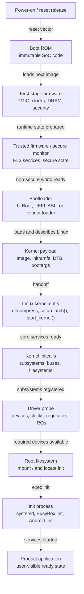

# Module 01 — Boot Chain: From Reset to User Space

## Overview

The boot chain runs from CPU reset to product application startup. The useful skill is not memorizing every vendor acronym. The useful skill is building a timeline that shows:

- which stage owns each part of boot
- which artifact is handed to the next stage
- which timestamp source is trustworthy for that stage
- which logs or traces prove the handoff happened correctly

A good boot map for an embedded Linux board also separates what is visible from Linux `dmesg` from what happened before the kernel existed.

## Generic boot chain



<svg width="760" height="840" viewBox="0 0 760 840" xmlns="http://www.w3.org/2000/svg" role="img" aria-labelledby="boot-chain-title boot-chain-desc">
  <title id="boot-chain-title">Generic embedded Linux boot chain</title>
  <desc id="boot-chain-desc">A vertical boot sequence from power-on to product application readiness, with ownership and observable evidence.</desc>
  <style>
    .stage { fill: #f6f8fa; stroke: #57606a; stroke-width: 1.2; rx: 6; }
    .handoff { fill: #ddf4ff; stroke: #0969da; stroke-width: 1.1; rx: 6; }
    .note { fill: #fff8c5; stroke: #9a6700; stroke-width: 1.1; rx: 6; }
    .title { font: 600 13px sans-serif; fill: #24292f; }
    .body { font: 11px sans-serif; fill: #57606a; }
    .arrow { stroke: #0969da; stroke-width: 2; marker-end: url(#arrowhead); }
    .side { stroke: #9a6700; stroke-width: 1.5; stroke-dasharray: 4 4; marker-end: url(#sidehead); }
  </style>
  <defs>
    <marker id="arrowhead" markerWidth="9" markerHeight="7" refX="8" refY="3.5" orient="auto">
      <polygon points="0 0, 9 3.5, 0 7" fill="#0969da" />
    </marker>
    <marker id="sidehead" markerWidth="9" markerHeight="7" refX="8" refY="3.5" orient="auto">
      <polygon points="0 0, 9 3.5, 0 7" fill="#9a6700" />
    </marker>
  </defs>

  <rect class="stage" x="70" y="20" width="300" height="54"/>
  <text class="title" x="220" y="43" text-anchor="middle">Power-on / reset release</text>
  <text class="body" x="220" y="61" text-anchor="middle">Board power, reset, straps, CPU vector</text>
  <line class="arrow" x1="220" y1="74" x2="220" y2="98"/>

  <rect class="stage" x="70" y="98" width="300" height="58"/>
  <text class="title" x="220" y="122" text-anchor="middle">Boot ROM</text>
  <text class="body" x="220" y="140" text-anchor="middle">Select boot media and load first image</text>
  <line class="side" x1="370" y1="127" x2="440" y2="127"/>
  <rect class="note" x="440" y="104" width="240" height="46"/>
  <text class="title" x="560" y="124" text-anchor="middle">Observe</text>
  <text class="body" x="560" y="141" text-anchor="middle">strap, ROM code, early UART</text>
  <line class="arrow" x1="220" y1="156" x2="220" y2="180"/>

  <rect class="stage" x="70" y="180" width="300" height="58"/>
  <text class="title" x="220" y="204" text-anchor="middle">Firmware / TF-A / vendor stages</text>
  <text class="body" x="220" y="222" text-anchor="middle">DRAM, clocks, PMIC, security state</text>
  <line class="arrow" x1="220" y1="238" x2="220" y2="262"/>

  <rect class="stage" x="70" y="262" width="300" height="58"/>
  <text class="title" x="220" y="286" text-anchor="middle">Bootloader</text>
  <text class="body" x="220" y="304" text-anchor="middle">Load kernel, initramfs, DTB, bootargs</text>
  <line class="side" x1="370" y1="291" x2="440" y2="291"/>
  <rect class="note" x="440" y="268" width="240" height="46"/>
  <text class="title" x="560" y="288" text-anchor="middle">Observe</text>
  <text class="body" x="560" y="305" text-anchor="middle">U-Boot log, env, DTB choice</text>
  <line class="arrow" x1="220" y1="320" x2="220" y2="344"/>

  <rect class="handoff" x="70" y="344" width="300" height="58"/>
  <text class="title" x="220" y="368" text-anchor="middle">Linux handoff payload</text>
  <text class="body" x="220" y="386" text-anchor="middle">Image + DTB pointer + command line</text>
  <line class="arrow" x1="220" y1="402" x2="220" y2="426"/>

  <rect class="stage" x="70" y="426" width="300" height="58"/>
  <text class="title" x="220" y="450" text-anchor="middle">Linux kernel entry</text>
  <text class="body" x="220" y="468" text-anchor="middle">Decompress, setup_arch(), start_kernel()</text>
  <line class="side" x1="370" y1="455" x2="440" y2="455"/>
  <rect class="note" x="440" y="432" width="240" height="46"/>
  <text class="title" x="560" y="452" text-anchor="middle">Observe</text>
  <text class="body" x="560" y="469" text-anchor="middle">earlycon, printk.time, banner</text>
  <line class="arrow" x1="220" y1="484" x2="220" y2="508"/>

  <rect class="stage" x="70" y="508" width="300" height="58"/>
  <text class="title" x="220" y="532" text-anchor="middle">Initcalls and driver probe</text>
  <text class="body" x="220" y="550" text-anchor="middle">Initialize subsystems and hardware</text>
  <line class="side" x1="370" y1="537" x2="440" y2="537"/>
  <rect class="note" x="440" y="514" width="240" height="46"/>
  <text class="title" x="560" y="534" text-anchor="middle">Observe</text>
  <text class="body" x="560" y="551" text-anchor="middle">initcall_debug, dmesg, ftrace</text>
  <line class="arrow" x1="220" y1="566" x2="220" y2="590"/>

  <rect class="stage" x="70" y="590" width="300" height="58"/>
  <text class="title" x="220" y="614" text-anchor="middle">Root filesystem</text>
  <text class="body" x="220" y="632" text-anchor="middle">Mount / from storage or initramfs</text>
  <line class="arrow" x1="220" y1="648" x2="220" y2="672"/>

  <rect class="stage" x="70" y="672" width="300" height="58"/>
  <text class="title" x="220" y="696" text-anchor="middle">Init process</text>
  <text class="body" x="220" y="714" text-anchor="middle">systemd, BusyBox init, Android init</text>
  <line class="arrow" x1="220" y1="730" x2="220" y2="754"/>

  <rect class="stage" x="70" y="754" width="300" height="58"/>
  <text class="title" x="220" y="778" text-anchor="middle">Product application ready</text>
  <text class="body" x="220" y="796" text-anchor="middle">The user-visible function is usable</text>
</svg>

## Boot sequence from reset to application

### 1. Power-on and reset release

Boot starts before software is visible. The board must provide stable power rails, a valid reset sequence, reference clocks, and boot-mode strap values. If this stage is wrong, no later log can explain the failure because no later software may have executed.

The owner is usually board hardware, PMIC configuration, reset wiring, strap pins, and early SoC behavior.

Evidence to collect:

- power rail measurements
- reset line timing
- reference clock status
- boot-mode strap configuration
- debugger program counter, if available

### 2. Boot ROM

Boot ROM is immutable code inside the SoC. It starts from the reset vector, reads boot-mode configuration, selects boot media, and tries to load the next boot image. On secure products, it may also authenticate that image.

The Boot ROM contract is:

```text
The next executable image has been found, loaded, and accepted.
```

If Linux produces no output, do not start at Linux. First decide whether the board reached Boot ROM, whether the expected boot media was selected, and whether the first image was accepted.

### 3. Firmware, memory initialization, and secure state

The next stage usually prepares the machine for a larger bootloader. On Arm systems this may involve SPL, TF-A, or vendor-specific firmware. The details vary, but the responsibilities are consistent: initialize DRAM, configure required clocks, set up PMIC state, establish security state, and prepare the CPU execution level for later stages.

The firmware contract is:

```text
The bootloader can run reliably from initialized memory with the expected CPU and security state.
```

Failures here often look like random bootloader crashes, resets while loading large images, or failures that only occur with certain image sizes or memory addresses.

### 4. Trusted firmware and secure monitor

Some systems include a secure monitor or trusted firmware stage. This code owns secure-world services and transitions the system into the non-secure world where the normal bootloader and Linux run.

For Linux bring-up, you do not need to know every secure-world implementation detail at first. You do need to know whether secure firmware owns clocks, power domains, authentication, or device access policy that Linux later depends on.

Common questions:

- Does secure firmware authenticate later images?
- Does it reserve memory that Linux must not use?
- Does it expose PSCI for CPU bring-up and power management?
- Does it control access to clocks, regulators, or peripherals?

### 5. Bootloader

The bootloader is the most visible pre-kernel stage. In many labs this is U-Boot, but the same model applies to UEFI, ABL, or vendor bootloaders.

The bootloader usually owns:

- loading the Linux kernel image
- loading an optional initramfs
- selecting or modifying the DTB
- constructing the kernel command line
- choosing boot slot, partition, or fallback path
- starting the kernel with `booti`, `bootm`, EFI boot, or a vendor-specific handoff

The bootloader contract is:

```text
Linux receives the right image, the right DTB, and the right bootargs.
```

This is where many bring-up mistakes become visible later. A wrong DTB can make a UART, storage device, sensor, or regulator disappear. A wrong `root=` bootarg can make rootfs mount fail. A wrong `console=` bootarg can make Linux appear silent even when it is running.

### 6. Kernel image, initramfs, DTB, and bootargs

The handoff into Linux is a payload, not just a jump address.

The important pieces are:

- **kernel image**: the Linux binary that will be decompressed or entered
- **initramfs**: optional early root filesystem loaded into memory
- **DTB**: compiled hardware description for the board
- **bootargs**: kernel command line parameters

At this boundary, record the exact artifacts. "The kernel booted" is not precise enough. You want to know which kernel, which DTB, which rootfs, and which command line.

Useful checks:

```bash
printenv
fdt addr
fdt print /model
fdt print /chosen
```

Inside Linux:

```bash
cat /proc/cmdline
dmesg | head -50
```

### 7. Linux kernel entry

After the bootloader jumps to Linux, the kernel performs architecture setup, decompresses or relocates itself when needed, parses the DTB and command line, initializes core subsystems, and enters `start_kernel()`.

This is the first stage where Linux-owned timestamps become available. A `dmesg` timestamp usually starts from the kernel's view of time, not from power-on. That means `dmesg` alone does not measure Boot ROM, firmware, or bootloader time.

Useful bootargs:

```text
earlycon
console=ttyS0,115200
printk.time=1
initcall_debug
```

### 8. Initcalls and driver probe

The kernel initializes subsystems through initcall levels. After buses and core frameworks are ready, drivers match devices and run probe functions.

The common device-tree flow is:

```text
DTB node
  -> platform device
  -> compatible string match
  -> driver probe()
  -> clocks/regulators/GPIO/IRQ/resources requested
  -> device ready
```

This stage often owns embedded boot delays. Examples include slow storage scan, deferred probe, regulator wait, firmware loading, display panel initialization, camera sensor power-up, and network fallback.

Useful evidence:

```bash
dmesg | grep -i probe
dmesg | grep -i deferred
cat /sys/kernel/debug/devices_deferred
```

For timing:

```bash
python3 scripts/parse-initcall-debug.py sample-data/initcall/initcall-debug-sample.log
python3 scripts/parse-ftrace-function-graph.py sample-data/ftrace/function-graph-sample.trace
```

### 9. Root filesystem mount

The kernel must mount a root filesystem before normal user space can start. Rootfs may come from eMMC, UFS, NVMe, SD card, network boot, NFS, initramfs, or a block device created by storage drivers.

The rootfs contract is:

```text
The root device exists, the filesystem driver exists, and the configured init program can be executed.
```

Common failures:

- wrong `root=` parameter
- missing storage driver
- missing filesystem driver
- storage appears late and needs `rootwait`
- partition UUID or device name changed
- init path is missing or not executable

### 10. Init process and product application

Once rootfs is mounted, the kernel starts the first user-space process. This may be systemd, BusyBox init, Android init, or a product-specific init.

At this point, define the metric carefully:

- **kernel boot complete**: Linux started user space
- **system boot complete**: init reached a selected target
- **product ready**: the actual user-visible function works

For a camera product, product ready might mean camera preview starts. For a wearable, it might mean sensors and display are ready. For a gateway, it might mean networking and the main service are accepting traffic.

## Qualcomm-style conceptual chain

The exact names vary across chip generations and product security models, but a conceptual chain often looks like this:

```text
PBL or Boot ROM
  -> early bootloader stage
  -> XBL or equivalent extended bootloader stage
  -> ABL / UEFI / bootloader handoff
  -> Linux kernel
  -> Android/Linux user space
```

The important point is not the exact acronym. The important point is to identify which stage owns:

- boot media selection
- authentication and verified boot
- clocks and DRAM
- PMIC and reset behavior
- image loading
- A/B slot or fallback policy
- device tree selection or overlays
- kernel command line
- Android or Linux user-space startup

Commercial Qualcomm BSPs often add secure boot, signed images, DDR training, PMIC initialization, A/B slots, and device tree overlays. This repository does not cover private vendor code; it focuses on publicly explainable boot principles and debugging methods.

## Timeline ownership map

Use this table when creating `labs/day1/01-bsp-boot-process/result.md`.

| Timeline stage | Likely owner | Main artifact | Typical evidence | Visible in Linux `dmesg`? |
|---|---|---|---|---|
| Power and reset | Board hardware / PMIC | power rails, reset lines, straps | scope, meter, debugger, board log | No |
| Boot ROM | SoC ROM | first boot image | ROM status, early UART, boot media mode | No |
| Firmware / TF-A | firmware / vendor BSP | DRAM setup, secure state | firmware log, DDR log, secure monitor log | Usually no |
| Bootloader | bootloader team / BSP | kernel image, DTB, bootargs | U-Boot log, `printenv`, selected DTB | No, except passed data |
| Kernel entry | kernel / BSP | kernel image, command line, DTB | earlycon, kernel banner, `/proc/cmdline` | Yes |
| Initcalls and probe | kernel / driver teams | drivers, DT nodes, resources | `initcall_debug`, `dmesg`, ftrace | Yes |
| Rootfs mount | kernel + rootfs owner | block device, filesystem, init path | mount logs, kernel panic message | Yes |
| Init and services | platform / application team | service units, scripts, product app | systemd logs, product timestamp | Partly |

## Questions to ask while reading a boot log

- Where does the timestamp start?
- Does it include firmware and bootloader time, or only kernel time?
- What image was loaded?
- Which device tree was selected?
- Which bootargs were passed to Linux?
- Was the root filesystem mounted from eMMC, UFS, NVMe, network, or initramfs?
- Which device was the last successful initialization before the failure?
- Which stage owns the last visible progress?
- What is not visible from the log you are reading?

## Boot map template

For Lab 1-1, create a one-page timeline with this shape:

```text
Stage:
Owner:
Input artifact:
Output / handoff:
Timestamp source:
Evidence:
Open question:
```

A good boot map does not need to be perfect. It needs to separate known facts from guesses. If a stage is invisible, mark it as invisible and write what evidence you would need next.
