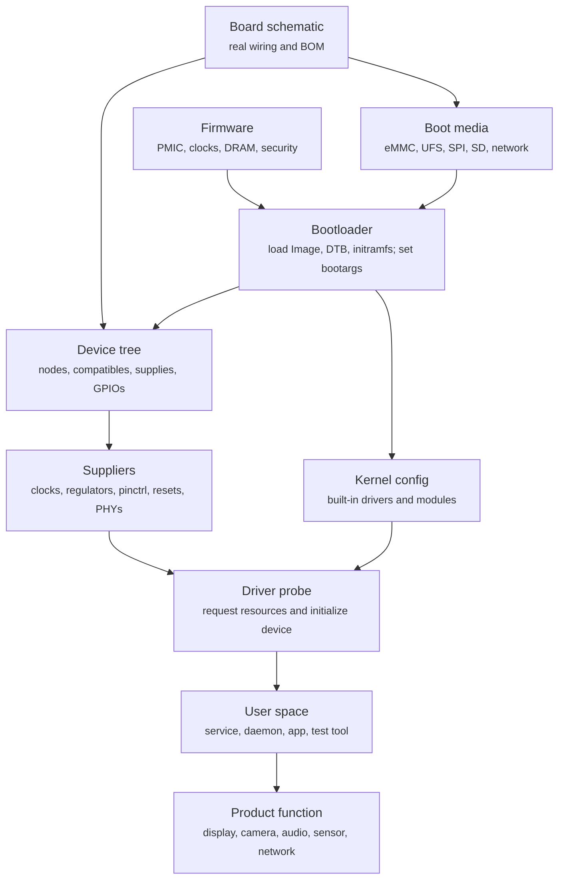
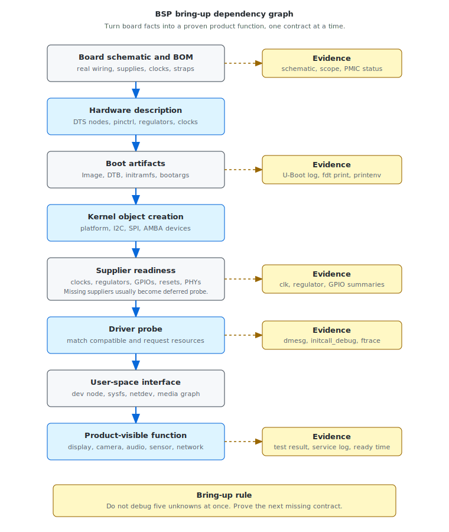

# Module 02 — BSP Bring-up

## Mental model

BSP bring-up is the work of turning a board design into a bootable, debuggable,
and product-ready Linux platform. It is not only "make the kernel boot." A BSP
engineer connects silicon behavior, board wiring, firmware assumptions,
bootloader policy, kernel configuration, device tree, drivers, root filesystem,
and product requirements.

The practical mindset is:

```text
Board fact
  -> hardware description
  -> boot artifact
  -> kernel object
  -> driver probe
  -> product-visible function
```

Every bring-up failure means one of those translations is wrong, missing, or not
yet proven.

For example, a camera sensor on the schematic is not automatically a Linux
camera device. It must be powered by the right regulators, clocked by the right
source, released from reset through the right GPIO, described in the device
tree, matched by a driver, connected to the right CSI receiver, and exposed to
user space through the expected media graph.

The BSP engineer's job is to make each step explicit and leave evidence behind.

## What a BSP engineer owns

A BSP engineer usually owns the platform boundary between hardware and the
operating system. The exact ownership varies by company, but the recurring
responsibilities are stable:

- bootloader board configuration
- kernel defconfig and module policy
- device tree source files and overlays
- clock, pinctrl, regulator, GPIO, reset, interrupt, PHY, and bus topology
- storage, display, camera, network, USB, PCIe, audio, sensor, and power enablement
- firmware loading paths and reserved-memory layout
- console, early logging, panic capture, and recovery paths
- boot logs, known issues, and handoff documentation
- boot-time, power, and product-readiness baselines

A good BSP is not only a set of patches. It is a set of contracts that other
teams can depend on.

## Bring-up as a dependency graph

Many bring-up problems are dependency problems. A device usually becomes usable
only after several suppliers are ready:





This is why the most useful bring-up question is rarely "Which driver is
broken?" The better question is:

```text
Which dependency was promised, and what evidence proves it was available when
the consumer asked for it?
```

## Bring-up sequence

The sequence below is intentionally conservative. It avoids debugging five
unknowns at the same time.

### 1. Confirm power, reset, and reference clocks

Before debugging software, confirm that the board is electrically alive. Power
rails must reach valid levels in the expected order, reset must release, and
reference clocks must be present.

Typical evidence:

- PMIC status or power-good signals
- scope captures for rails and reset lines
- reference clock measurement
- boot strap values
- debugger program counter, if available

If this stage is not proven, a missing UART log does not mean a UART problem.

### 2. Confirm the first console path

UART is usually the first practical debug channel. It should be treated as a
bring-up dependency, not as a convenience.

Check:

- the physical UART header or connector
- voltage level and adapter compatibility
- baud rate
- pinmux
- bootloader console settings
- kernel `console=` and `earlycon` settings
- device tree `status = "okay"` and compatible string

The console path proves that later evidence can be trusted.

### 3. Confirm Boot ROM and first image loading

The Boot ROM selects boot media and loads the first executable image. On secure
systems it may also authenticate that image.

Evidence may include:

- Boot ROM status code
- early UART output
- boot-mode strap configuration
- storage access pattern
- recovery-mode behavior

If the first image is not loaded, Linux is not involved.

### 4. Confirm firmware and DRAM initialization

Firmware prepares the machine for larger software. DRAM must be initialized
before a normal bootloader or kernel payload can run reliably.

Common symptoms of a firmware or DRAM issue:

- bootloader crashes at different points
- large image loads fail
- random resets during decompression
- failures depend on image address or memory size

Evidence includes firmware logs, DDR training logs, memory test results, and
bootloader stability while loading large payloads.

### 5. Confirm bootloader control

The bootloader is the first stage where BSP engineers often get interactive
control. Use it to inspect exactly what Linux will receive.

Useful U-Boot checks:

```bash
printenv
bdinfo
fdt addr
fdt print /model
fdt print /chosen
fdt print /aliases
```

Record:

- selected boot media
- kernel image path and load address
- DTB path and load address
- initramfs path and load address, if used
- final `bootargs`
- boot command used, such as `booti`, `bootm`, or EFI boot

The bootloader contract is:

```text
Linux receives the correct image, the correct DTB, and the correct command line.
```

### 6. Reach kernel early console

Kernel early console is the first proof that the handoff into Linux worked.

Useful bootargs:

```text
console=ttyS0,115200
earlycon
printk.time=1
initcall_debug
ignore_loglevel
```

The exact console device depends on the platform. QEMU `virt` commonly uses
`ttyAMA0`; many 8250-style UARTs use `ttyS0`; other SoCs use platform-specific
names.

If the bootloader prints but Linux is silent, compare:

- bootloader `bootargs`
- device tree UART node
- `stdout-path` under `/chosen`
- kernel UART driver configuration
- earlycon compatibility

### 7. Mount root filesystem

Rootfs bring-up proves that the storage path, filesystem support, and init path
are usable.

The rootfs contract is:

```text
The root device exists, the filesystem can be mounted, and init can be executed.
```

Common failures:

- wrong `root=` argument
- missing storage driver
- storage appears late and needs `rootwait`
- missing filesystem driver
- init path is absent or not executable
- initramfs was not loaded at the address Linux expects

Evidence includes mount logs, VFS messages, `/proc/cmdline`, and panic messages
such as "Unable to mount root fs" or "No working init found."

### 8. Enable peripherals one by one

After the board reaches a shell or minimal user space, enable product devices in
small batches. Avoid enabling display, camera, audio, sensors, PCIe, USB, and
networking all at once unless the platform is already mature.

For each device, prove:

```text
device tree node exists
  -> kernel creates a device
  -> driver matches compatible string
  -> probe requests resources
  -> resources are available
  -> user-space interface appears
  -> product-level test passes
```

This turns a vague "device does not work" problem into a specific missing
contract.

## Evidence map

| Bring-up area | Contract to verify | Evidence to collect |
|---|---|---|
| Power and reset | Rails, reset, straps, and clocks are valid | scope capture, PMIC status, boot strap check |
| Boot media | Boot ROM can read the selected medium | ROM status, storage activity, recovery behavior |
| Firmware | DRAM, clocks, and security state are usable | firmware log, DDR training log, memory test |
| Bootloader | Linux payload and metadata are correct | U-Boot log, `printenv`, selected DTB, load addresses |
| Kernel handoff | Linux starts with the expected command line and DTB | early console, kernel banner, `/proc/cmdline` |
| Rootfs | root device and init path are usable | VFS log, mount log, shell prompt |
| Device tree | hardware description matches board wiring | `dtc`, `fdt print`, `/proc/device-tree`, driver match |
| Driver probe | resources are present when the driver asks | `dmesg`, `initcall_debug`, `devices_deferred` |
| User space | services can consume kernel interfaces | service logs, test tools, product-ready timestamp |

## Device tree bring-up workflow

Device tree work should start from the schematic, not from copying a similar
board file blindly.

Use this workflow:

1. Identify the real device on the schematic.
2. Identify the bus, address, interrupt, reset, clock, regulator, and pinmux.
3. Find the binding documentation for the driver.
4. Write or adapt the DTS node.
5. Compile the DTB and check warnings.
6. Confirm the bootloader passes the intended DTB.
7. Confirm Linux creates the device.
8. Confirm the driver matches the `compatible`.
9. Confirm `probe()` succeeds or fails with a useful reason.

Useful commands:

```bash
dtc -I dtb -O dts board.dtb > board.dts
find /proc/device-tree -maxdepth 3 -type f | sort
dmesg | grep -i "of:"
dmesg | grep -i deferred
cat /sys/kernel/debug/devices_deferred
```

When a probe fails, read the first missing dependency. Do not patch around it
until you understand whether the missing clock, regulator, GPIO, IRQ, PHY, or
firmware is genuinely required.

## Kernel configuration workflow

Kernel config determines whether a device can ever bind to a driver.

For each required function, decide whether the driver should be:

- built in, because it is needed before rootfs or during early boot
- a module, because it can load later from rootfs
- disabled, because the board does not use it

Examples:

| Function | Common config decision |
|---|---|
| boot storage controller | usually built in |
| root filesystem driver | built in or included in initramfs |
| early UART console | built in |
| display panel | built in or module depending on product boot requirement |
| camera sensor | often module unless needed during early product readiness |
| debug-only drivers | disabled in production or kept in engineering builds |

For boot-time optimization, built-in versus module is not only a size decision.
It changes when initialization runs and who waits for it.

## Common bring-up failure patterns

### No serial output

Possible owners:

- board power or reset
- UART wiring or adapter voltage
- boot-mode straps
- firmware never reached UART setup
- bootloader console disabled
- wrong baud rate
- wrong `console=` or `earlycon`
- UART node disabled or pinmux missing

Start by proving the earliest stage that can print.

### Bootloader works, kernel is silent

Likely boundary:

```text
bootloader -> kernel handoff
```

Check:

- kernel image format and load address
- DTB address and contents
- final bootargs
- `console=`
- `earlycon`
- memory map and reserved memory

Do not assume Linux failed. It may be running without a console.

### Kernel starts, rootfs fails

Likely boundary:

```text
kernel storage/device init -> root filesystem mount
```

Check:

- `root=` argument
- storage driver availability
- filesystem driver availability
- partition name, UUID, or label
- `rootwait`
- initramfs contents

### Device appears in DTS but driver does not probe

Check:

- node `status`
- `compatible` string
- kernel config
- bus registration
- address and interrupt cells
- required supplier phandles
- probe deferral logs

The DTS node is only a description. It is not proof that a driver initialized.

### Device probe is slow

Slow probe may be correct or it may hide a dependency issue. Use timing evidence
before changing behavior.

Useful evidence:

```text
initcall_debug
ftrace function_graph
dmesg timestamps
product-ready timestamp
```

Then decide whether initialization can be moved later, made async, cached,
parallelized, or removed from the boot-critical path.

## Bring-up notes template

Use this structure when reporting a new board issue:

```text
Symptom:
  What is visible, and at which stage did progress stop?

Expected contract:
  What should the previous stage have provided?

Evidence:
  Logs, traces, register dumps, scope captures, or command output.

Owner:
  Hardware, firmware, bootloader, kernel config, device tree, driver, rootfs,
  or user space.

Narrowest unknown:
  The one thing that must be proven next.

Next action:
  One test that will reduce the unknown space.
```

Example:

```text
Symptom:
  U-Boot prints correctly, but Linux shows no console output.

Expected contract:
  Bootloader passes a DTB with the enabled UART node and bootargs containing
  console=ttyS0,115200 earlycon.

Evidence:
  U-Boot printenv shows bootargs without console=.
  fdt print /chosen shows no stdout-path.

Owner:
  Bootloader environment / board DTS handoff.

Narrowest unknown:
  Whether Linux is booting silently or failing before printk.

Next action:
  Add console and earlycon bootargs, then compare the next boot log.
```

## Bring-up rule

Do not debug five unknowns at the same time. Reduce the system until there is
only one unknown left.

For a new board, this usually means:

```text
serial console first
  -> bootloader control
  -> kernel early console
  -> minimal rootfs
  -> one peripheral at a time
  -> product-ready path
```

Every time a stage starts working, capture the evidence and save the baseline.
That baseline becomes the next known-good point when the system breaks again.
