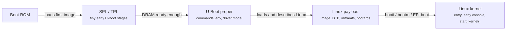
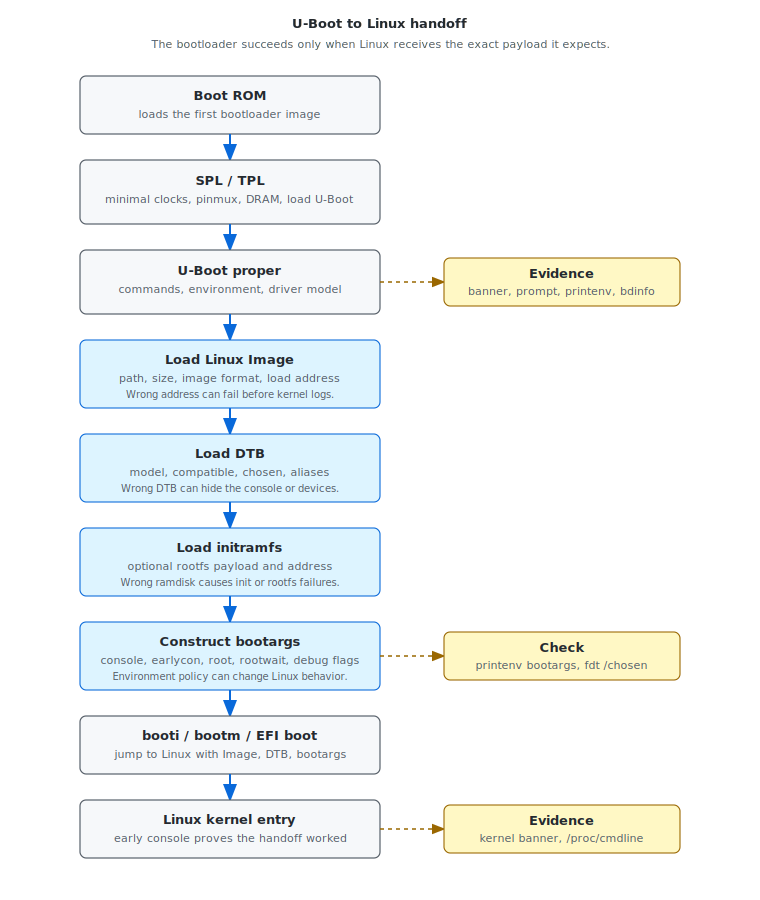

# Module 03 — U-Boot Internals for BSP Engineers

## Mental model

U-Boot is often the last controllable stage before Linux. For BSP engineers, its
main value is not just that it can boot a kernel. Its value is that it exposes
the handoff contract between pre-kernel software and Linux.

That contract is:

```text
Linux receives:
  - the right kernel image
  - the right DTB
  - the right initramfs, if used
  - the right command line
  - a valid CPU, memory, and device state
```

When Linux fails to print, mounts the wrong root filesystem, loses the serial
console, probes the wrong devices, or boots a different board variant, U-Boot is
one of the first places to inspect.

## Why U-Boot matters

U-Boot usually sits between firmware and Linux:





On simple QEMU direct-boot labs, U-Boot may be bypassed. On real boards, it
often owns important decisions:

- which storage device or partition to boot from
- which kernel image to load
- which DTB or overlay to use
- whether an initramfs is loaded
- which bootargs Linux receives
- whether secure boot, verified boot, or FIT signatures are checked
- whether network, USB, display splash, or recovery paths run before Linux

That makes U-Boot both a bring-up tool and a source of boot-time cost.

## Execution stages

U-Boot is not always a single binary running from a fully initialized system.
Many platforms use multiple stages.

### TPL and SPL

TPL and SPL are tiny early stages used when the full U-Boot image cannot run
yet. The board may not have full DRAM, full clocks, storage drivers, or a rich
console path.

Typical SPL responsibilities:

- initialize minimal clocks and pinmux
- initialize DRAM
- load U-Boot proper from boot media
- perform early authentication or image selection on secure products

If SPL fails, U-Boot proper may never print. Treat this as a pre-bootloader or
early-bootloader problem, not a Linux problem.

### U-Boot proper

U-Boot proper is the interactive stage most engineers recognize. It provides:

- command shell
- environment variables
- driver model
- storage and network access
- device tree commands
- image loading and verification
- Linux handoff commands

This is the stage where you can usually inspect the boot contract directly.

### Relocation

U-Boot often starts at one address and relocates itself to another area of RAM.
Relocation allows it to run from a better memory location after DRAM is ready.

Why this matters:

- early addresses in logs may not match post-relocation addresses
- symbols in the ELF must be interpreted with relocation in mind
- crashes before and after relocation have different owners
- memory layout mistakes can overwrite kernel, DTB, initramfs, or U-Boot itself

When debugging U-Boot crashes, record whether the failure happened before or
after relocation.

## U-Boot as a payload builder

The most important BSP view of U-Boot is this:

```text
boot media
  -> load kernel Image
  -> load DTB
  -> load initramfs, if used
  -> construct bootargs
  -> apply fixups
  -> jump to Linux
```

Each artifact should be recorded exactly.

| Artifact | What to record | Why it matters |
|---|---|---|
| Kernel image | path, partition, size, load address, image format | wrong image or address can fail before Linux logs |
| DTB | filename, load address, `/model`, `/compatible`, `/chosen` | wrong DTB can hide UART, storage, sensors, regulators |
| Initramfs | path, load address, size | wrong initramfs can cause rootfs or init failure |
| Bootargs | final command line | wrong `console=`, `root=`, `earlycon`, or `rootwait` changes Linux behavior |
| Memory map | DRAM banks, reserved memory, load addresses | overlapping payloads cause early crashes |

Useful commands:

```bash
printenv
bdinfo
iminfo ${kernel_addr_r}
fdt addr ${fdt_addr_r}
fdt print /model
fdt print /compatible
fdt print /chosen
```

The goal is to replace "U-Boot boots Linux" with a precise statement:

```text
U-Boot loaded Image A at address X, DTB B at address Y, initramfs C at address Z,
passed bootargs D, and entered Linux with command E.
```

## Environment variables

U-Boot environment variables are powerful because they can change boot behavior
without rebuilding U-Boot. They are risky for the same reason.

Common variables:

| Variable | Meaning |
|---|---|
| `bootcmd` | command sequence run after autoboot delay |
| `bootdelay` | seconds to wait before running `bootcmd` |
| `bootargs` | kernel command line, if not generated dynamically |
| `fdtfile` | DTB filename or board variant selector |
| `kernel_addr_r` | RAM address for the kernel image |
| `fdt_addr_r` | RAM address for the DTB |
| `ramdisk_addr_r` | RAM address for initramfs |
| `boot_targets` | ordered list of boot sources on distro-style configs |
| `ethaddr` | Ethernet MAC address used by network boot |
| `serverip` / `ipaddr` | network boot configuration |

Inspect the environment:

```bash
printenv
printenv bootcmd
printenv bootargs
printenv boot_targets
```

For production, environment policy matters. A lab board may accept fallback
boot paths and interactive delays. A shipping product usually needs controlled
boot order, predictable timing, and a clear recovery policy.

## Device tree handoff

U-Boot may pass a DTB exactly as stored on disk, or it may modify it before
handoff. Common fixups include:

- memory size
- reserved memory
- chosen node
- stdout path
- MAC addresses
- board revision
- boot slot
- display panel or camera overlay
- secure firmware reserved regions

Useful commands:

```bash
fdt addr ${fdt_addr_r}
fdt print /chosen
fdt print /memory
fdt print /reserved-memory
fdt print /aliases
```

The most important node for early bring-up is often `/chosen`:

```text
/chosen {
    bootargs = "...";
    stdout-path = "...";
};
```

If Linux has no console, check both `bootargs` and `stdout-path`. A valid UART
driver in Linux is not enough if Linux was told to use the wrong console.

## Image formats

U-Boot supports several boot image styles.

### Raw `Image`

On Arm64, Linux is often booted with a raw `Image` and the `booti` command:

```bash
booti ${kernel_addr_r} ${ramdisk_addr_r}:${filesize} ${fdt_addr_r}
```

This flow is simple and common for development.

### `uImage`

Older flows may use a U-Boot-wrapped kernel image with metadata. These are
usually booted with `bootm`.

### FIT image

FIT images can bundle multiple kernels, DTBs, ramdisks, configurations, hashes,
and signatures. They are useful for secure or multi-variant products.

FIT can answer:

```text
Which kernel, which DTB, and which ramdisk belong together?
Was the selected configuration verified before boot?
```

FIT also adds boot-time cost if hashes, signatures, storage reads, or
configuration selection are expensive.

## Driver model

U-Boot has its own driver model. It is not Linux's driver model.

This matters because a device may work in U-Boot but fail in Linux, or the other
way around.

Examples:

- U-Boot can read eMMC, but Linux lacks the storage driver or DT node.
- U-Boot can print on UART, but Linux gets the wrong `console=`.
- U-Boot can use Ethernet for TFTP, but Linux network probe fails later.
- Linux can use a device that U-Boot never initialized.

Useful commands vary by configuration, but often include:

```bash
dm tree
dm uclass
mmc list
mmc dev 0
usb tree
pci enum
```

When a device works in U-Boot, use that as evidence but not as proof that Linux
will work. The two stages may use different drivers, clocks, pinctrl, and DT
interpretation.

## ELF analysis checklist

When you have a U-Boot ELF under `local-artifacts/uboot-elf/`, inspect it like
any other boot-stage binary.

Commands:

```bash
readelf -h local-artifacts/uboot-elf/u-boot
readelf -S local-artifacts/uboot-elf/u-boot
readelf -s local-artifacts/uboot-elf/u-boot | less
objdump -d local-artifacts/uboot-elf/u-boot | less
nm -n local-artifacts/uboot-elf/u-boot | less
```

Look for:

- entry point
- section layout: `.text`, `.rodata`, `.data`, `.bss`
- relocation-related symbols
- board init functions
- command table symbols
- driver model symbols
- image verification symbols
- storage and network driver symbols

ELF analysis is not only for reverse engineering. It helps answer practical
questions:

```text
Is this the U-Boot binary I think it is?
Does it contain the command or driver I expect?
Where is the entry point?
Which board code was linked?
```

## U-Boot boot-time costs

U-Boot time is often invisible from Linux `dmesg`. If a product has a 4-second
bootloader delay, Linux may still report a fast kernel boot. Measure the whole
chain.

Common U-Boot costs:

| Cost | Cause | Question to ask |
|---|---|---|
| Autoboot delay | `bootdelay` waits for key input | Is an interactive delay required in production? |
| Storage scanning | many boot targets or repeated partition scans | Can boot order be narrowed? |
| Network fallback | DHCP/TFTP timeout | Is network fallback required outside recovery builds? |
| USB scan | slow bus enumeration | Is USB boot part of the product requirement? |
| Display splash | panel and framebuffer init | Is splash required before Linux? |
| FIT verification | hashes/signatures | Is it required by security policy, and can it be optimized safely? |
| Device tree fixups | board detection, overlays | Can fixups be simplified or cached? |
| Excessive logging | slow serial output | Is engineering verbosity enabled in production? |

Optimization must respect product requirements. Do not remove verification,
recovery, or diagnostic behavior unless the product owner explicitly accepts the
trade-off.

## Debugging the U-Boot to Linux handoff

Use this structure when Linux behavior does not match expectation.

```text
Symptom:
  Linux starts but the expected UART console is missing.

Expected contract:
  U-Boot passes bootargs containing console=ttyS0,115200 earlycon and a DTB with
  the UART node enabled.

Evidence:
  printenv bootargs does not include console=.
  fdt print /chosen shows no stdout-path.

Conclusion:
  The kernel may be running, but the U-Boot handoff did not describe the console
  correctly.

Next check:
  Set bootargs and stdout-path, then compare early kernel output.
```

Other common handoff failures:

| Symptom | Likely handoff issue |
|---|---|
| Linux silent after `booti` | wrong console, wrong image address, invalid DTB, CPU state issue |
| Kernel panic: unable to mount rootfs | wrong `root=`, missing storage driver, initramfs not loaded |
| Wrong board peripherals appear | wrong DTB or overlay |
| Device probe defers forever | missing supplier node, regulator, clock, reset, or GPIO |
| Random early crash | payload overlap, bad memory map, wrong reserved-memory |

## Practical U-Boot report template

For Labs 1-3 and 1-4, use this shape:

```text
U-Boot version:
Board/config:
Storage path:
Kernel image:
DTB:
Initramfs:
Bootargs:
Boot command:
Visible boot-time costs:
Handoff risk:
Next evidence needed:
```

Example:

```text
U-Boot version:
  U-Boot 2025.x for qemu_arm64

Kernel image:
  Image loaded to ${kernel_addr_r}

DTB:
  qemu_arm64 virt DTB at ${fdt_addr_r}

Bootargs:
  console=ttyAMA0 earlycon initcall_debug root=/dev/ram0

Visible boot-time costs:
  autoboot delay and storage scan

Handoff risk:
  bootargs are environment-controlled, so production builds need locked policy.
```

## Working rule

When debugging U-Boot, separate three questions:

1. Did U-Boot itself initialize correctly?
2. Did U-Boot load the expected Linux payload artifacts?
3. Did U-Boot describe the machine correctly when handing control to Linux?

Do not stop at "U-Boot reached `booti`." The real bring-up question is whether
Linux received the exact image, DTB, initramfs, command line, and memory layout
that the board required.
