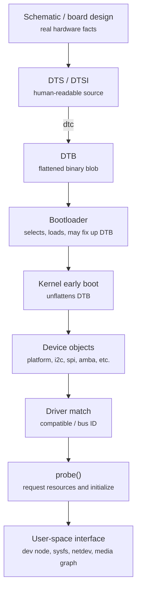
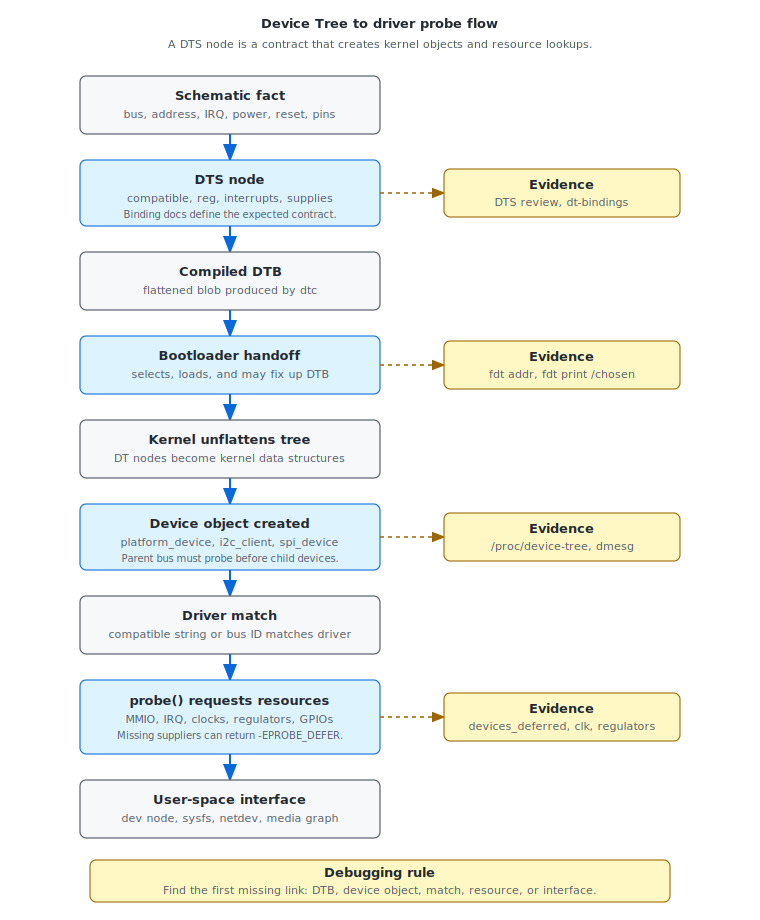

# Module 04 — Device Tree, Platform Devices, and Probe

## Mental model

Device Tree is not code, but it controls which code runs.

On embedded Linux systems, many devices cannot be discovered automatically. The
kernel needs a hardware description that says what exists, where it is mapped,
which interrupt it uses, which clock powers it, which regulator supplies it,
which reset line releases it, and which driver should bind to it.

The practical flow is:

```text
schematic fact
  -> DTS node
  -> compiled DTB
  -> bootloader handoff
  -> kernel device object
  -> driver match
  -> probe()
  -> user-space interface
```

A device tree node is therefore a contract. It says:

```text
This hardware exists, these are its resources, and this is how Linux should
match it to a driver.
```

If the contract is incomplete or wrong, Linux may silently skip the device,
bind the wrong driver, defer probe forever, or initialize hardware in the wrong
order.

## Device Tree lifecycle

Device Tree moves through several forms before a driver probes:





This lifecycle gives you a debugging checklist. When a device is missing, ask
where it disappeared:

```text
Was it in the schematic?
Was it described in DTS?
Was that DTS compiled into the DTB that actually booted?
Did the bootloader pass that DTB?
Did Linux create a device object?
Did a driver match it?
Did probe succeed?
Did user space get the expected interface?
```

## Minimal platform device flow

For a simple memory-mapped device described by Device Tree, the flow is:

```text
DTS node
  -> flattened DTB
  -> unflattened kernel tree
  -> platform_device created
  -> driver compatible match
  -> probe() called
```

For devices on buses, the bus adds another layer:

```text
I2C controller node
  -> I2C adapter driver probes
  -> child sensor node becomes i2c_client
  -> sensor driver compatible match
  -> sensor probe() called
```

This distinction matters. If an I2C sensor does not probe, the sensor node may
be correct while the I2C controller, pinctrl, clock, or regulator is still
missing.

## Important properties

Device Tree properties are not decorative. They are read by kernel subsystems
and drivers.

| Property | Meaning | Common failure |
|---|---|---|
| `compatible` | driver match string | no driver binds, or wrong driver binds |
| `reg` | MMIO address, bus address, or chip select | driver maps wrong address or child device is absent |
| `interrupts` | IRQ line and trigger type | driver probes but interrupts never arrive |
| `clocks` / `clock-names` | clock providers required by device | probe fails, defers, or device times out |
| `resets` / `reset-names` | reset controller lines | hardware stays held in reset |
| `pinctrl-*` | pinmux and pin configuration states | pins remain in GPIO/default/incorrect function |
| `gpios` / `*-gpios` | GPIO lines for reset, enable, detect, IRQ, etc. | power sequencing or detect logic fails |
| `*-supply` | regulator supplies | probe defers or hardware is unpowered |
| `power-domains` | power domain provider | device cannot power on or runtime PM fails |
| `iommus` | DMA translation setup | DMA fails or device cannot attach |
| `dma-coherent` | cache coherency property | data corruption or unnecessary cache maintenance |
| `status` | whether node is enabled | disabled nodes do not create usable devices |

Always read the binding documentation for the device. Similar-looking nodes
from another board may compile but still be wrong.

## A small DTS example

A simplified UART node might look like this:

```dts
uart0: serial@10000000 {
    compatible = "vendor,soc-uart";
    reg = <0x10000000 0x1000>;
    interrupts = <32>;
    clocks = <&gcc UART0_CLK>;
    pinctrl-names = "default";
    pinctrl-0 = <&uart0_default>;
    status = "okay";
};
```

The kernel does not execute this node. Instead, it uses the node to create a
device and match it to a driver whose `of_match_table` contains a compatible
string such as `"vendor,soc-uart"`.

The corresponding driver shape is conceptually:

```c
static const struct of_device_id vendor_uart_of_match[] = {
    { .compatible = "vendor,soc-uart" },
    { }
};

static struct platform_driver vendor_uart_driver = {
    .probe = vendor_uart_probe,
    .driver = {
        .name = "vendor-uart",
        .of_match_table = vendor_uart_of_match,
    },
};
```

If the strings do not match, `probe()` is never called.

## From DTB to Linux evidence

Debugging Device Tree requires proving which DTB actually booted.

Useful bootloader commands:

```bash
fdt addr ${fdt_addr_r}
fdt print /model
fdt print /compatible
fdt print /chosen
fdt print /aliases
```

Useful Linux commands:

```bash
cat /proc/device-tree/model
tr '\0' '\n' < /proc/device-tree/compatible
cat /proc/cmdline
find /proc/device-tree -maxdepth 3 -type f | sort
```

Useful offline commands:

```bash
dtc -I dtb -O dts board.dtb > board.dts
dtc -I dts -O dtb board.dts -o board.dtb
fdtdump board.dtb | less
```

If U-Boot prints one DTB name and Linux exposes another model or compatible
string, the handoff is not what you think it is.

## Device creation by bus type

Device Tree can create different kernel object types depending on where the node
lives.

| Node location | Kernel object | Typical driver |
|---|---|---|
| root or SoC simple-bus child | `platform_device` | `platform_driver` |
| I2C controller child | `i2c_client` | `i2c_driver` |
| SPI controller child | `spi_device` | `spi_driver` |
| MDIO bus child | PHY device | PHY driver |
| MIPI DSI host child | panel or bridge device | DRM panel/bridge driver |
| sound card node | ASoC card/components | ASoC machine/component drivers |

This matters for debugging because the parent bus must exist first. A sensor
node can be perfect, but it will not become an `i2c_client` if the I2C
controller did not probe.

## Resource lookup in probe

Most probe functions translate Device Tree properties into kernel resources:

```text
platform_get_resource()
devm_ioremap_resource()
platform_get_irq()
devm_clk_get()
devm_regulator_get()
devm_gpiod_get()
devm_reset_control_get()
pinctrl_select_state()
```

If one required resource is missing, the driver may:

- fail immediately
- return `-EPROBE_DEFER`
- continue with degraded behavior
- time out while waiting for hardware that was never powered or clocked

The return code and log message matter. A failed probe is not just a driver
problem; it may be a missing Device Tree supplier.

## Deferred probe

Deferred probe is not a bug by itself. It means the consumer driver asked for a
supplier that is not available yet.

Common causes:

- regulator provider not ready
- clock provider not ready
- GPIO controller not ready
- reset controller not ready
- PHY or power-domain provider not ready
- parent bus did not probe
- missing or wrong phandle
- supplier driver missing from kernel config
- node disabled with `status = "disabled"`

Useful commands:

```bash
dmesg | grep -i deferred
cat /sys/kernel/debug/devices_deferred
cat /sys/kernel/debug/clk/clk_summary
cat /sys/kernel/debug/regulator/regulator_summary
cat /sys/kernel/debug/gpio
```

Deferred probe can also affect boot time. A deferred device may retry several
times, block a product service, or hide a missing supplier until late boot.

## Dependency graph thinking

For any important device, draw its dependency graph:

```text
camera sensor
  -> I2C controller
  -> CSI receiver
  -> MCLK clock
  -> AVDD/DVDD/IOVDD regulators
  -> reset GPIO
  -> powerdown GPIO
  -> pinctrl state
  -> media graph endpoint
```

Then mark each dependency as:

```text
described in DT
  -> provider device exists
  -> provider driver probed
  -> consumer probe reached
  -> consumer probe succeeded
```

This method is better than randomly editing DTS properties until the log
changes.

## Common Device Tree failure patterns

### Device node exists, but no driver probes

Check:

- `status = "okay"`
- `compatible` string spelling
- driver `of_match_table`
- kernel config
- parent bus registration
- whether the booted DTB is the one you edited

### Driver probes, but hardware does not respond

Check:

- `reg` address or bus address
- clocks
- regulators
- reset GPIO polarity
- pinctrl state
- interrupt polarity
- required delays in driver or power sequence

### Linux has no console

Check:

- U-Boot `bootargs`
- `/chosen/stdout-path`
- UART node status
- UART compatible string
- pinctrl
- clock and reset dependencies
- kernel UART driver config

### Storage is visible in U-Boot but not Linux

Check:

- storage controller node in DTB
- pinctrl and clocks
- regulator supplies
- kernel driver config
- bootargs `root=`
- `rootwait`

U-Boot and Linux do not share drivers. U-Boot success is useful evidence, not a
guarantee.

### Probe storm or repeated deferred probe

Check:

- `devices_deferred`
- missing supplier phandles
- disabled supplier nodes
- provider driver config
- probe ordering and device links
- whether a noncritical device can be moved out of the boot-critical path

## Boot-time optimization angle

Device Tree can create boot-time cost. Examples:

- enabling unused devices that probe during boot
- describing slow peripherals as built-in critical devices
- missing suppliers that cause deferred probe retries
- wrong dependency graph that forces timeouts
- display, camera, audio, or network devices initialized before product need
- excessive firmware loading or calibration during boot-critical path

Before changing DTS for speed, ask:

```text
Is this device required before product-ready?
Is the wait required for hardware correctness?
Can it be made a module, async probe, deferred service, or later runtime init?
What evidence proves the new order is safe?
```

## Review checklist

Use this checklist when reviewing a DTS change:

| Check | Question |
|---|---|
| Board match | Does the node match the actual schematic and BOM? |
| Binding | Does it follow the binding documentation? |
| Compatible | Does a driver match the compatible string? |
| Address | Is `reg` correct for the bus/address space? |
| Interrupt | Is IRQ number and trigger type correct? |
| Suppliers | Are clocks, regulators, resets, GPIOs, PHYs, and power domains correct? |
| Pinctrl | Are pins muxed to the intended function? |
| Status | Is the node enabled only on boards that have the hardware? |
| Handoff | Is this DTB the one U-Boot actually passes? |
| Evidence | Does `dmesg` prove the expected driver probed? |

## Debug report template

Use this structure for Device Tree and probe issues:

```text
Symptom:
  What is missing or failing?

Device node:
  Path in DTS/DTB.

Expected driver:
  Driver name and compatible string.

Expected resources:
  reg, IRQ, clocks, regulators, resets, GPIOs, pinctrl, bus parent.

Evidence:
  U-Boot fdt output, /proc/device-tree, dmesg, devices_deferred, debugfs summaries.

Conclusion:
  The narrowest missing or incorrect contract.

Next action:
  One change or measurement that proves the hypothesis.
```

Example:

```text
Symptom:
  Camera sensor does not appear in the media graph.

Device node:
  /soc/i2c@.../camera@36

Expected driver:
  vendor,camera-sensor in sensor driver's of_match_table.

Evidence:
  Node exists in /proc/device-tree.
  devices_deferred shows camera@36 waiting for avdd-supply.
  regulator_summary does not contain the expected AVDD regulator.

Conclusion:
  The sensor node references a regulator supplier that is missing or disabled.

Next action:
  Fix the regulator node or supply phandle, then verify probe and media graph.
```

## Working rule

Do not treat Device Tree as a pile of properties. Treat it as the hardware
contract that causes kernel objects to exist.

For every important device, prove the chain:

```text
DTS node exists
  -> booted DTB contains it
  -> kernel creates the device
  -> driver matches it
  -> probe gets every required resource
  -> user space sees the expected interface
```

If one step is missing, fix that step first.
