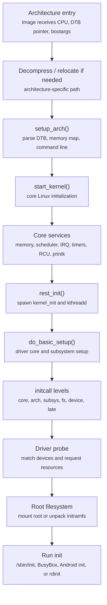
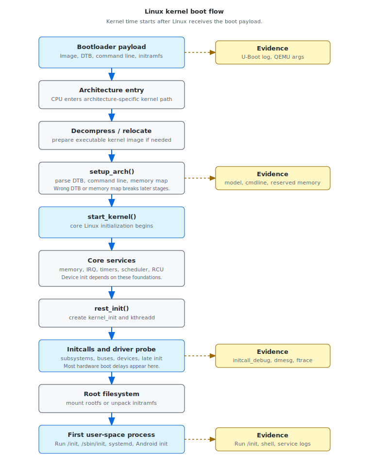

# Module 05 — Linux Kernel Boot Flow

## Mental model

The Linux kernel boot flow is the part of the boot chain where Linux finally
owns the machine. Before this point, firmware and the bootloader prepared the
payload. After this point, the kernel must turn that payload into a running
system:

```text
Image + DTB + command line + optional initramfs
  -> architecture setup
  -> core kernel services
  -> initcalls
  -> driver probe
  -> rootfs
  -> first user-space process
```

For BSP and boot-time work, the useful question is not "Did Linux boot?" The
useful question is:

```text
Which kernel stage consumed time, failed a contract, or handed bad state to the
next stage?
```

Kernel timestamps start after Linux has control. They do not measure Boot ROM,
firmware, or U-Boot time unless an external timestamp source is added.

## High-level kernel sequence





This sequence is simplified, but it is good enough for reading boot logs and
assigning ownership.

## Kernel entry contract

The kernel does not start from nothing. It receives a handoff from the
bootloader or from QEMU direct boot.

The handoff must provide:

- a valid kernel image entry point
- a valid DTB pointer or platform description
- a valid command line
- usable memory that does not overlap the kernel, DTB, or initramfs
- CPU execution state expected by the architecture
- optional initramfs address and size

If this contract is broken, the kernel may fail before any normal console is
available. Early console and bootloader logs are the first evidence sources.

## Why `start_kernel()` matters

`start_kernel()` is the center of early kernel initialization. It sets up the
minimum operating environment before normal kernel threads and driver
initialization can proceed.

At a high level, this stage prepares:

- printk and console infrastructure
- memory management
- CPU and scheduler basics
- IRQ handling
- timers and timekeeping
- RCU
- workqueues
- driver model foundations
- initcall execution

If `start_kernel()` cannot establish these basics, later driver and rootfs
debugging is premature.

## Architecture setup

Architecture setup translates the bootloader payload into kernel state. On Arm
systems, this includes parsing the DTB, setting up memory zones, reserving
regions, initializing CPU features, and preparing the platform description.

Useful evidence:

```text
Linux version banner
Machine model
earlycon output
Memory map and reserved-memory logs
Kernel command line
```

Useful commands after boot:

```bash
cat /proc/cmdline
cat /proc/iomem
cat /proc/device-tree/model
tr '\0' '\n' < /proc/device-tree/compatible
```

If the wrong DTB or command line was passed, the kernel may still boot but later
devices can be missing or misconfigured.

## Core services before initcalls

Before the kernel can initialize devices, it must initialize the infrastructure
that device initialization depends on.

Examples:

| Core service | Why it matters |
|---|---|
| memory management | drivers allocate memory and map MMIO |
| IRQ subsystem | drivers request interrupts |
| timers/timekeeping | timeouts, sleeps, and timestamps need time |
| scheduler | kernel threads and workqueues require scheduling |
| RCU | many kernel data structures depend on RCU |
| printk/console | logs and panic messages become visible |
| driver core | devices and drivers can register and bind |

When reading logs, separate core-kernel setup from device initialization. They
have different owners and different optimization options.

## `rest_init()` and kernel threads

`rest_init()` is the transition from early single-threaded kernel setup to a
system with kernel threads.

Important threads:

- `kernel_init`: continues initialization and eventually starts user space
- `kthreadd`: parent for kernel threads

Conceptually:

```text
start_kernel()
  -> rest_init()
      -> create kernel_init
      -> create kthreadd
      -> scheduler starts running normal kernel threads
```

This is where the kernel starts to look like an operating system rather than a
single early initialization path.

## Initcall levels

Initcalls are initialization functions registered into ordered levels. The order
exists so basic infrastructure is ready before dependent subsystems and drivers.

Common levels include:

| Level | Typical content |
|---|---|
| `early` | very early kernel setup |
| `core` | core infrastructure |
| `postcore` | support code after core setup |
| `arch` | architecture-specific initialization |
| `subsys` | buses and subsystems |
| `fs` | filesystem setup |
| `device` | device and driver initialization |
| `late` | late cleanup and final initialization |

A slow initcall may represent real hardware initialization. Or it may represent
avoidable waiting, missing dependencies, synchronous firmware loading, or debug
behavior that should not run on the product-critical path.

## Driver probe in the boot flow

Driver probe is where Device Tree and kernel config become real hardware
initialization.

The usual flow is:

```text
device object exists
  -> driver matches
  -> probe() runs
  -> clocks/regulators/GPIOs/IRQs requested
  -> hardware initialized
  -> user-space interface appears
```

This is where many embedded boot delays live:

- slow storage scans
- repeated deferred probe
- regulator waits
- firmware loading
- display panel power sequencing
- camera sensor initialization
- network fallback
- audio codec and clock setup

Do not classify a delay as "kernel core" just because it appears in `dmesg`.
Use initcall names, probe logs, and ftrace to identify the owner.

## Root filesystem and first user space

The kernel boot path reaches a major boundary when it can start init.

Rootfs may come from:

- initramfs
- eMMC, UFS, SD, NVMe, USB storage
- NFS or network boot
- RAM disk

The rootfs contract is:

```text
The root device exists, the filesystem is supported, and an executable init path
is available.
```

Useful log lines include:

```text
Freeing unused kernel memory
Run /init as init process
VFS: Mounted root
Kernel panic - not syncing: VFS: Unable to mount root fs
No working init found
```

Kernel boot complete is not necessarily product boot complete. Starting init
only proves the kernel handed control to user space.

## Analysis command line

Useful kernel command-line parameters for analysis:

```text
earlycon
console=ttyS0,115200
printk.time=1
initcall_debug
ignore_loglevel
loglevel=8
ftrace=function_graph
trace_event=initcall:initcall_start,initcall:initcall_finish
```

Use only what your kernel supports. Some options increase boot time or log
volume, so keep separate engineering and production baselines.

For QEMU `virt`, the console is commonly:

```text
console=ttyAMA0 earlycon initcall_debug ignore_loglevel loglevel=8
```

## Evidence map

| Kernel stage | Contract to verify | Evidence |
|---|---|---|
| Kernel entry | kernel received valid payload | early banner, earlycon, command line |
| Architecture setup | DTB, memory, CPU features parsed correctly | model, memory map, reserved-memory logs |
| Core services | scheduler, IRQ, timers, memory, printk ready | early kernel logs, panic visibility |
| Initcalls | ordered init functions completed | `initcall_debug`, trace events |
| Driver probe | required devices initialized | `dmesg`, ftrace, `devices_deferred` |
| Rootfs | root device and init path available | VFS logs, initramfs logs, panic messages |
| First user space | init process executed | `Run /init`, shell prompt, systemd/Android init logs |

## Reading `initcall_debug`

When `initcall_debug` is enabled, the kernel prints lines like:

```text
calling  physmap_init+0x0/0x30 @ 1
initcall physmap_init+0x0/0x30 returned 0 after 20119 usecs
```

The important fields are:

| Field | Meaning |
|---|---|
| function name | init function that ran |
| return value | success or error code |
| duration | time spent in that initcall |
| timestamp | kernel log time when message was printed |

Use the parser in this repository:

```bash
python3 scripts/parse-initcall-debug.py sample-data/initcall/initcall-debug-sample.log
```

For Lab 1-5, the output should become a ranked list of initialization delays.

## Common failure patterns

### Kernel prints nothing

Likely boundary:

```text
bootloader -> kernel entry
```

Check:

- image format and load address
- DTB address
- command line
- `console=`
- `earlycon`
- CPU state and memory map

### Kernel starts, then hangs during initcalls

Check:

- last `calling ...` line from `initcall_debug`
- driver probe logs around the last timestamp
- interrupt, clock, regulator, reset, and firmware dependencies
- whether the initcall is waiting for hardware

### Kernel reaches rootfs panic

Check:

- `root=`
- `rootwait`
- storage driver availability
- filesystem driver availability
- initramfs contents
- partition UUID, label, or device name

### Kernel reaches init but product is not ready

The kernel has done its part only up to user-space handoff. Product readiness
may still wait on services, firmware, sensors, display, camera, network, or an
application.

Record a separate product-ready timestamp.

## Boot-time optimization angle

Kernel boot optimization starts with ownership.

Do not optimize a delay until you know whether it belongs to:

- kernel core setup
- driver probe
- rootfs mount
- initramfs unpack
- user-space startup
- product service readiness

Common safe directions:

- remove unused built-in drivers from product config
- make noncritical drivers modules
- fix deferred probe storms
- reduce synchronous firmware loading on the critical path
- use async probe only when ordering is safe
- remove engineering-only debug parameters from production measurements
- trim initramfs contents

Every optimization needs before/after evidence and a regression guard.

## Debug report template

Use this structure for kernel boot flow issues:

```text
Symptom:
  What is visible, and where did progress stop?

Timestamp source:
  printk.time, external power timestamp, bootloader timestamp, or trace clock.

Last known good stage:
  Kernel entry, architecture setup, initcall level, driver probe, rootfs, or init.

Evidence:
  Bootargs, dmesg excerpt, initcall_debug, ftrace, rootfs panic, or service log.

Likely owner:
  Kernel core, driver, Device Tree, rootfs, or user space.

Next action:
  One measurement or change that narrows the unknown.
```

Example:

```text
Symptom:
  Kernel reaches initcalls but product-ready time is slow.

Timestamp source:
  printk.time=1 and initcall_debug.

Evidence:
  initcall_debug shows camera_subsys_init returned after 798912 usecs.
  ftrace shows regulator_wait_ready consumed 300240 usecs.

Likely owner:
  Camera driver/resource initialization, not user-space startup.

Next action:
  Verify regulator dependency correctness and decide whether camera init is
  required before product-ready.
```

## Working rule

Kernel boot logs are evidence, but their timestamps start after Linux owns the
machine. Always separate:

```text
pre-kernel time
  -> kernel entry and core setup
  -> initcalls and driver probe
  -> rootfs and first init
  -> product-ready user space
```

For each delay or failure, identify the earliest stage where the expected
contract stopped being true.
